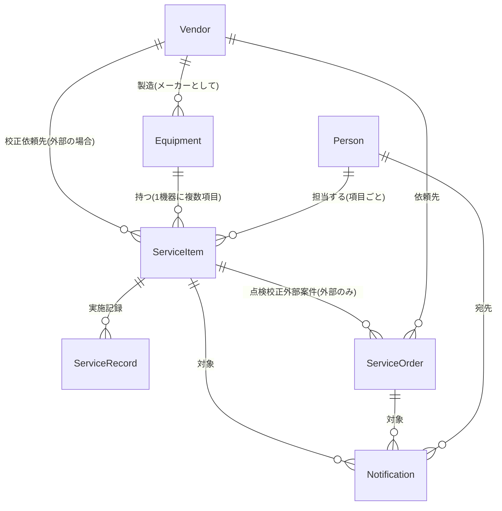

# 機器点検・校正期限管理アプリ — ドメインモデル

機器の点検・校正の期限を管理し、担当者へ通知するアプリケーション。
バックエンドなし・LocalStorage永続化・CSVバックアップ。

## 1. 用語(ユビキタス言語)

| 用語            | 英語名                 | 意味                                                                          |
| --------------- | ---------------------- | ----------------------------------------------------------------------------- |
| 機器            | Equipment              | 点検・校正の対象となる機器・設備                                            |
| メーカー/取引先 | Vendor                 | 機器の製造元、または外部点検校正の依頼先。両方を兼ねる場合あり                    |
| 担当者          | Person                 | 点検・校正の管理責任者。通知の宛先                                            |
| 点検校正項目    | ServiceItem         | 機器に紐づく管理単位。「月次点検」「年次校正」など。周期と内部/外部区分を持つ |
| 実施記録        | ServiceRecord       | 項目ごとの実施の記録。実施のたびに次回期限が更新される                              |
| 点検校正外部案件    | ServiceOrder       | 外部点検校正の発注1件。発注〜返却までの進捗と納期を追跡                           |
| 通知            | Notification           | 期限接近・発注推奨などのアプリ内通知                                          |
| 周期            | Cycle                  | 点検・校正の間隔。1/3/6ヶ月、1/2/3/5/10年                                     |
| 標準納期        | Standard Lead Time     | 外部点検校正の依頼先ごとの標準的な所要日数                                        |
| 発注推奨日      | Recommended Order Date | 期限から納期と余裕日数を逆算した、発注すべき日                                |

日本語名はこの表の表記に統一する。Vendor は「メーカー/取引先」(中黒「メーカー・取引先」は使わない)、ServiceOrder は「点検校正外部案件」、ServiceRecord は一覧表示も含め「実施記録」(「実施履歴」は使わない)で統一する(D-038)。

エンティティ英語名は Service 系(ServiceItem / ServiceRecord / ServiceOrder)で統一する。総称の Service は点検・校正の両種別を包含する傘の語であり、種別を表す enum 値(`inspection` / `calibration`)や案件状態の `inCalibration` とは役割が異なるため衝突しない。旧名 InspectionItem / InspectionRecord / CalibrationOrder は接頭辞が種別 enum と衝突し「点検項目の種別が校正」のような矛盾した読みを生むため廃止(旧永続化データはスキーマ v3 マイグレーションで無損失変換。旧ヘッダ `inspectionItemId` を含む既エクスポートCSVはインポート互換なし、要再エクスポート)(D-045)。

ServiceOrder を指す略記の order 系命名も serviceOrder 系へ統一する: ルート `/orders` → `/service-orders`、永続化状態キー `orders` → `serviceOrders`、`ServiceRecord.orderId` → `serviceOrderId`、Notification の `targetType` 値 `order` → `serviceOrder`、コードの Order* 識別子 → ServiceOrder*。発注という行為を指す語(`orderedDate`、項目ステータス `orderNow`、通知種別 `orderRecommended`、発注推奨日)は ServiceOrder の略記ではないため対象外。旧永続化データはスキーマ v4 マイグレーションで無損失変換。旧ヘッダ `orderId` を含む records の既エクスポートCSVはインポート互換なし、要再エクスポート(D-046)。

ServiceRecord を指す略記の record 系命名も serviceRecord 系へ統一する: 永続化状態キー `records` → `serviceRecords`、コードの Record\*/record\* 識別子(`RecordModal` → `ServiceRecordModal`、`RECORD_RESULT` → `SERVICE_RECORD_RESULT`、`addRecord` → `addServiceRecord`、`recordsOf` → `serviceRecordsOf` 等)。TypeScript 組込みの `Record<K, V>` 型と汎用ヘルパ `utils/record`(`recordValue` / `isRecord`)はエンティティの略記ではないため対象外。旧永続化データはスキーマ v5 マイグレーションで無損失変換。CSV は列ヘッダ(フィールド名)不変のため既エクスポートCSVのインポート互換は維持(エクスポートのファイル名接頭辞のみ `records_` → `serviceRecords_`)(D-050)。

## 2. エンティティ関連図



## 3. エンティティ定義

### 3.1 Vendor(メーカー/取引先)

メーカーと校正業者を1エンティティに統合。区分フラグで役割を表現。
機器のメーカーが自社製品の校正も請け負うケースが多いため。

| 属性                 | 型            | 必須 | 説明                                 |
| -------------------- | ------------- | ---- | ------------------------------------ |
| id                   | string (uuid) | ○    |                                      |
| name                 | string        | ○    | 名称                                 |
| isManufacturer       | boolean       | ○    | メーカーか                           |
| isCalibrator         | boolean       | ○    | 校正業者か                           |
| contactPerson        | string        |      | 窓口担当者名                         |
| email                | string        |      | 連絡先メール                         |
| phone                | string        |      | 電話番号                             |
| standardLeadTimeDays | number        |      | 標準納期(日数)。校正業者の場合に使用 |
| note                 | string        |      | 備考                                 |

### 3.2 Person(担当者)

| 属性       | 型            | 必須 | 説明                                         |
| ---------- | ------------- | ---- | -------------------------------------------- |
| id         | string (uuid) | ○    |                                              |
| name       | string        | ○    | 氏名                                         |
| email      | string        | ○    | メールアドレス(通知宛先の表示用)             |
| department | string        |      | 部署                                         |
| isActive   | boolean       | ○    | 有効フラグ。退職・異動で無効化(削除はしない) |

### 3.3 Equipment(機器)

| 属性           | 型            | 必須 | 説明                                                 |
| -------------- | ------------- | ---- | ---------------------------------------------------- |
| id             | string (uuid) | ○    |                                                      |
| managementNo   | string        | ○    | 管理番号(ユニーク)                                   |
| name           | string        | ○    | 機器名称                                             |
| model          | string        |      | 型式                                                 |
| serialNo       | string        |      | シリアル番号                                         |
| manufacturerId | string        |      | Vendor参照                                           |
| location       | string        |      | 設置場所                                             |
| status         | enum          | ○    | `active`(稼働) / `suspended`(休止) / `retired`(廃棄) |
| note           | string        |      | 備考                                                 |

- `suspended` / `retired` の機器は期限計算・通知の対象外。
- 機器の削除は論理削除(`retired`)を基本とし、履歴を保持する。
- 休止 → 稼働の復帰時、配下項目の `nextDueDate` は据え置き(リセットしない)。休止中に期限超過していれば復帰後 overdue として表示される(D-002)。

### 3.4 ServiceItem(点検校正項目)— 中核エンティティ

1機器に複数登録可能(例: 「月次点検」+「年次校正」)。

| 属性             | 型            | 必須    | 説明                                                     |
| ---------------- | ------------- | ------- | -------------------------------------------------------- |
| id               | string (uuid) | ○       |                                                          |
| equipmentId      | string        | ○       | Equipment参照                                            |
| type             | enum          | ○       | `inspection`(点検) / `calibration`(校正)                 |
| name             | string        | ○       | 項目名(例:「月次点検」「年次校正」)                      |
| cycle            | enum          | ○       | `1M` `3M` `6M` `1Y` `2Y` `3Y` `5Y` `10Y`                 |
| execution        | enum          | ○       | `internal`(内部) / `external`(外部)                      |
| vendorId         | string        | 外部時○ | 校正依頼先。Vendor参照                                   |
| leadTimeDays     | number        |         | 納期(日数)。未設定ならVendorのstandardLeadTimeDaysを使用 |
| bufferDays       | number        | ○       | 発注余裕日数(デフォルト: 14)                             |
| personId         | string        | ○       | 担当者。Person参照                                       |
| noticeDaysBefore | number        | ○       | 通知開始日数(期限の何日前から通知。デフォルト: 30)       |
| lastDoneDate     | date          |         | 最終実施日                                               |
| nextDueDate      | date          | ○       | 次回期限(初回は手入力、以降は実施記録から自動計算)       |
| isActive         | boolean       | ○       | 項目の有効フラグ                                         |

### 3.5 ServiceRecord(実施記録)

| 属性     | 型            | 必須 | 説明                                                     |
| -------- | ------------- | ---- | -------------------------------------------------------- |
| id       | string (uuid) | ○    |                                                          |
| serviceItemId   | string        | ○    | ServiceItem参照                                       |
| doneDate | date          | ○    | 実施日                                                   |
| doneBy   | string        | ○    | 実施者名(外部の場合は業者名)                             |
| result   | enum          | ○    | `pass`(合格) / `fail`(不合格) / `adjusted`(調整の上合格) |
| serviceOrderId | string   |      | 外部点検校正の場合、元になったServiceOrder参照           |
| note     | string        |      | 備考(校正証明書番号など)                                 |

- 記録登録時に `serviceItem.lastDoneDate = doneDate`、`serviceItem.nextDueDate = doneDate + cycle` を自動更新。
- `fail` の場合は次回期限を更新せず、要対応状態として扱う。
- 校正値・合格基準の数値記録はスコープ外。記録は `result`(pass/fail/adjusted)とメモ(`note`)のみで、数値入力・判定機能は持たない(D-004)。

### 3.6 ServiceOrder(点検校正外部案件)

外部項目の発注1回分。発注前の推奨日逆算(標準納期)と、発注後の個別納期追跡の両方を担う。

| 属性         | 型            | 必須 | 説明                           |
| ------------ | ------------- | ---- | ------------------------------ |
| id           | string (uuid) | ○    |                                |
| serviceItemId       | string        | ○    | ServiceItem参照             |
| vendorId     | string        | ○    | 依頼先                         |
| status       | enum          | ○    | 下記の状態遷移参照             |
| orderedDate  | date          |      | 発注日                         |
| dueDate      | date          |      | 返却予定日(業者回答の個別納期) |
| returnedDate | date          |      | 実返却日                       |
| cost         | number        |      | 費用                           |
| note         | string        |      | 備考                           |

**状態遷移:**

```
planned(発注準備) → ordered(発注済) → inCalibration(校正中) → returned(返却済) → completed(記録登録済)
                                                              ↘ cancelled(中止)
```

- `returned` 後、ServiceRecordを登録すると `completed` になり、項目の次回期限が更新される。
- 遷移は上図の隣接遷移のみ(飛び越し不可)。加えて `planned`〜`returned` の各段階から `cancelled`(中止)へ遷移できる(図は代表経路のみ図示)。`completed` / `cancelled` からの再遷移は不可。

### 3.7 Notification(通知)

アプリ内通知のみ(バックエンドなしのためメール実送信はしない)。
アプリ起動時・日付変更時に全項目をスキャンして生成。

| 属性        | 型            | 必須 | 説明               |
| ----------- | ------------- | ---- | ------------------ |
| id          | string (uuid) | ○    |                    |
| type        | enum          | ○    | 下記の通知種別参照 |
| targetType  | enum          | ○    | `serviceItem` / `serviceOrder`   |
| targetId    | string        | ○    | 対象のID           |
| personId    | string        | ○    | 宛先担当者         |
| message     | string        | ○    | 通知文             |
| createdDate | date          | ○    | 発生日             |
| isRead      | boolean       | ○    | 既読フラグ         |

**通知種別:**

| type               | 対象       | 発生条件                            |
| ------------------ | ---------- | ----------------------------------- |
| `dueSoon`          | 内部・外部 | 今日 ≥ 期限 − noticeDaysBefore      |
| `overdue`          | 内部・外部 | 今日 > 期限                         |
| `orderRecommended` | 外部のみ   | 今日 ≥ 発注推奨日 かつ 未発注       |
| `deliveryDueSoon`  | 発注済案件 | 今日 ≥ 返却予定日 − 7日 かつ 未返却 |
| `deliveryOverdue`  | 発注済案件 | 今日 > 返却予定日 かつ 未返却       |

- 同一対象・同一種別の未読通知は重複生成しない。
- `overdue` と `dueSoon` の条件は重なるため、期限超過後はより深刻な `overdue` のみを生成し `dueSoon` は生成しない(`deliveryOverdue` / `deliveryDueSoon` も同様)。同一項目への二重通知はノイズになるため(D-041)。
- `orderRecommended` の「未発注」は「有効な案件(`planned`〜`returned`)が1件もない」と解釈する。`planned` の案件があれば発注準備は着手済みであり再通知は不要なため(§4.3 orderNow の「有効な案件なし」と同じ判定。D-042)。
- 担当者(Person)を無効化しても宛先はフォールバックせず元 personId のまま。無効化後も通知は生成・表示し続ける(D-001)。

## 4. 期限計算ロジック

### 4.1 次回期限

```
nextDueDate = lastDoneDate + cycle
```

月単位の加算は暦月ベース(例: 1/31 + 1M → 2/28)。

### 4.2 発注推奨日(外部のみ)

```
leadTime = serviceItem.leadTimeDays ?? vendor.standardLeadTimeDays
発注推奨日 = nextDueDate − leadTime − bufferDays
```

### 4.3 項目ステータス(導出値。保存しない)

優先度順に判定:

| ステータス           | 条件                                            |
| -------------------- | ----------------------------------------------- |
| `overdue`(期限切れ)  | 今日 > nextDueDate                              |
| `orderNow`(要発注)   | 外部 かつ 今日 ≥ 発注推奨日 かつ 有効な案件なし |
| `inProgress`(校正中) | 外部 かつ ordered/inCalibration の案件あり      |
| `dueSoon`(期限接近)  | 今日 ≥ nextDueDate − noticeDaysBefore           |
| `ok`(正常)           | 上記以外                                        |

## 5. 永続化・バックアップ

- **永続化**: LocalStorage。zustand `persist` ミドルウェアを使用。スキーマバージョンを持たせ、マイグレーションに備える。
- **CSVバックアップ**:
  - エクスポート: 全エンティティを個別CSV(またはまとめて1ファイルずつダウンロード)。
  - インポート: CSVから復元。zodでバリデーションし、不正行はエラー表示。
  - 文字コードはUTF-8(BOM付き。Excel互換のため)。

技術スタックは [tech-stack.md](../guides/architecture/tech-stack.md) を参照。

## 6. 未決事項

- [ ] 期限の起算: 実施日基準か、当初予定日基準か(現状: 実施日基準)
