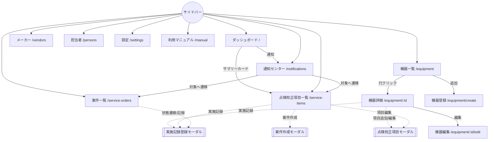

# 機器点検・校正期限管理アプリ — 画面設計書

本書は [`docs/spec/domain-model.md`](../domain-model.md) に基づく画面設計書である。ドメインモデルで定義したエンティティ・属性・状態遷移・期限計算ロジックを画面へ落とし込むことを目的とし、モデルと矛盾する仕様は定義しない。

- **対象読者**: フロントエンド実装者、レビュアー。本書はコンポーネント分割・実装に着手できる粒度を目指す。
- **前提技術**: 詳細は [tech-stack.md](../../guides/architecture/tech-stack.md) を参照。
- 未決事項は [domain-model.md](../domain-model.md) の未決事項節を参照。

---

## 0. 共通仕様

各画面の記述より前に、全画面横断の共通ルールをここに集約する。個別画面ではこのセクションを参照する。

### 0.1 全体構成

- 単一ページアプリケーション(SPA)。バックエンドAPIは持たず、状態はZustand + `persist` ミドルウェアでLocalStorageに永続化する。スキーマバージョンを保持しマイグレーションに備える(ドメインモデル §5)。
- **共通レイアウト**:
  - 左サイドバーナビゲーション(全ルートへのリンク)。
  - ヘッダー: アプリ名、右端に通知ベルアイコン + 未読件数バッジ(未読0のときバッジ非表示)。ベルクリックで `/notifications` へ遷移。
  - モバイル幅ではサイドバーをハンバーガーメニューに畳む(オーバーレイ表示)。

```
┌───────────────────────────────────────────────────────────┐
│ ☰  機器点検校正管理                              🔔 3     │  ← ヘッダー
├──────────┬────────────────────────────────────────────────┤
│ ▸ダッシュ │                                                │
│ ▸機器一覧 │                                                │
│ ▸項目一覧 │              各画面のコンテンツ                │
│ ▸点検校正外部案件 │                                                │
│ ▸メーカー │                                                │
│ ▸担当者   │                                                │
│ ▸通知     │                                                │
│ ▸設定     │                                                │
│ ▸利用マニュアル│                                          │
└──────────┴────────────────────────────────────────────────┘
```

### 0.2 ルーティング一覧

| パス                  | 画面                       | 節                             | 備考                               |
| --------------------- | -------------------------- | ------------------------------ | ---------------------------------- |
| `/`                   | ダッシュボード             | [§1](./01-dashboard.md)        |                                    |
| `/equipment`          | 機器一覧                   | [§2](./02-equipment-list.md)   |                                    |
| `/equipment/create`      | 機器登録                   | [§3](./03-equipment-form.md)   | フォーム画面                       |
| `/equipment/:id`      | 機器詳細(項目・記録含む)   | [§4](./04-equipment-detail.md) |                                    |
| `/equipment/:id/edit` | 機器編集                   | [§3](./03-equipment-form.md)   | フォーム画面                       |
| `/service-items`              | 点検校正項目一覧(中核)     | [§5](./05-service-item-list.md)        | クエリでステータスフィルタ受け取り |
| `/service-orders`             | 点検校正外部案件(かんばん) | [§8](./08-service-orders.md)           |                                    |
| `/vendors`            | メーカー/取引先マスタ      | [§9](./09-masters.md)          |                                    |
| `/persons`            | 担当者マスタ               | [§9](./09-masters.md)          |                                    |
| `/notifications`      | 通知センター               | [§10](./10-notifications.md)   |                                    |
| `/settings`           | 設定                       | [§11](./11-settings.md)        |                                    |
| `/manual`             | 利用マニュアル             | [§12](./12-manual.md)          |                                    |

**画面ファイル一覧(目次)**:

- [1. ダッシュボード](./01-dashboard.md)
- [2. 機器一覧](./02-equipment-list.md)
- [3. 機器登録・編集](./03-equipment-form.md)
- [4. 機器詳細](./04-equipment-detail.md)
- [5. 点検校正項目一覧(中核画面)](./05-service-item-list.md)
- [6. 点検校正項目モーダル](./06-service-item-modal.md)
- [7. 実施記録登録モーダル](./07-service-record-modal.md)
- [8. 点検校正外部案件](./08-service-orders.md)
- [9. マスタ管理(メーカー/取引先・担当者)](./09-masters.md)
- [10. 通知センター](./10-notifications.md)
- [11. 設定](./11-settings.md)
- [12. 利用マニュアル](./12-manual.md)

**モーダルで行う操作(ページ遷移しない)**: 点検校正項目の登録・編集([§6](./06-service-item-modal.md))、実施記録登録([§7](./07-service-record-modal.md))、点検校正外部案件の作成・状態更新([§8](./08-service-orders.md))、Vendor/Person の追加・編集([§9](./09-masters.md))。これらは機器詳細・点検校正項目一覧・案件一覧などから起動する。

### 0.3 ステータスバッジ色(共通定義)

項目ステータス(ドメインモデル §4.3 の導出値。保存しない)の表示色を全画面で統一する。

| ステータス   | ラベル   | 色    |
| ------------ | -------- | ----- |
| `overdue`    | 期限切れ | 🔴 赤 |
| `orderNow`   | 要発注   | 🟠 橙 |
| `inProgress` | 校正中   | 🔵 青 |
| `dueSoon`    | 期限接近 | 🟡 黄 |
| `ok`         | 正常     | 🟢 緑 |

- 判定は上表の優先度順(上が優先)。判定条件・優先度の詳細は [domain-model.md §4.3](../domain-model.md) を参照。導出関数は1箇所(例: `deriveServiceItemStatus(serviceItem, serviceOrders, today)`)に集約し、全画面がこれを利用する。
- 色トークンはTailwindのユーティリティ(例: `bg-red-100 text-red-800` 等)へマッピングし、`statusBadgeClass(status)` の単一ヘルパで供給する。

### 0.4 日付表示形式

- 表示・入力・CSVすべて `YYYY-MM-DD`(ISO 8601 日付)で統一する。時刻は扱わない。
- 月加算(`+cycle`)は暦月ベース(ドメインモデル §4.1。例: 1/31 + 1M → 2/28)。

### 0.5 モーダルの共通挙動

- オーバーレイ(半透明背景)+ 中央ダイアログ。オーバーレイクリック / `Esc` キー / 右上×で閉じる。ただしフォーム編集中に閉じる場合は破棄確認を出す。
- フォーム系モーダルはreact-hook-form + zodResolver。送信ボタンは検証エラー時は無効化しない(送信試行でエラー表示)。送信成功でモーダルを閉じ、元画面を再描画する。
- モーダル起動時、対象を編集する場合は既存値をプリフィルする。

### 0.6 確認ダイアログポリシー

- **破壊的・不可逆に近い操作**は確認ダイアログを必須とする: 機器の廃棄(status=retired)、Vendor削除、Person無効化、CSVインポート確定、データ全削除。
- データ全削除のみ2段階確認(チェックボックス同意 → 実行ボタン、[§11](./11-settings.md))。
- 通常の保存・状態遷移は確認なしで即時反映(取り消しは状態を戻す操作で対応)。

### 0.7 空状態(共通方針)

各一覧はデータ0件時に、中央にアイコン + 説明文 + 主要CTA(「追加」ボタン等)を表示する。個別文言は各画面に記載。

---

## 画面遷移図

主要画面間のフローを示す(モーダルは破線ノード)。


