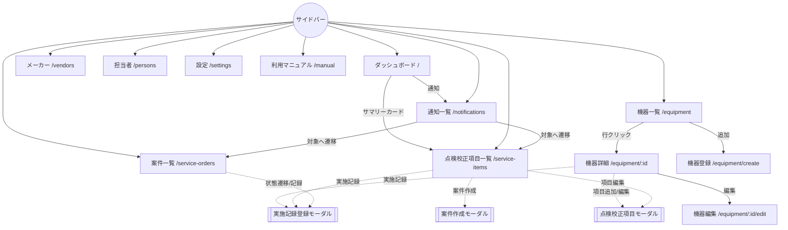

# 機器点検・校正期限管理アプリ — 画面設計書

本書は [`docs/spec/domain-model.md`](../domain-model.md) に基づく画面設計書である。ドメインモデルで定義したエンティティ・属性・状態遷移・期限計算ロジックを画面へ落とし込むことを目的とし、モデルと矛盾する仕様は定義しない。

- **対象読者**: フロントエンド実装者、レビュアー。本書はコンポーネント分割・実装に着手できる粒度を目指す。
- **前提技術**: 詳細は [tech-stack.md](../../guides/architecture/tech-stack.md) を参照。
- 未決事項は [domain-model.md](../domain-model.md) の未決事項節を参照。

---

## 0. 共通仕様

各画面の記述より前に、全画面横断の共通ルールをここに集約する。個別画面ではこのセクションを参照する。

### 0.1 全体構成

- 単一ページアプリケーション(SPA)。バックエンドAPIは持たず、状態はZustand + `persist` ミドルウェアでLocalStorageに永続化する。スキーマバージョンを保持しマイグレーションに備える(ドメインモデル §5)。
- **共通レイアウト**:
  - 左サイドバーナビゲーション(全ルートへのリンク)。リンクラベルは画面見出しの「一覧」を省いた短縮表記(「機器」「点検校正項目」等。D-083)。
  - ヘッダー: アプリ名、右端に通知ベルアイコン + 未読件数バッジ(未読0のときバッジ非表示)。ベルクリックで `/notifications` へ遷移。
  - 画面タイトル(h1)は表示しない(D-088)。現在地はサイドバーの選択状態で示す。例外: 利用マニュアル(長文ドキュメントで「ページ上部へ戻る」(D-067)のスクロール先が h1)と、機器詳細・機器フォーム等の内容を伴う見出し(機器名など)は維持。一覧画面の追加ボタンは検索・フィルタ行の右端に置き、通知一覧の「全て既読」はタブバー右端(Tabs の actions スロット)に置く。
  - モバイル幅ではサイドバーをハンバーガーメニューに畳む(オーバーレイ表示)。

```
┌───────────────────────────────────────────────────────────┐
│ ☰  機器点検校正管理                              🔔 3     │  ← ヘッダー
├──────────┬────────────────────────────────────────────────┤
│ ▸ダッシュ │                                                │
│ ▸機器     │                                                │
│ ▸点検校正項目 │          各画面のコンテンツ                │
│ ▸点検校正外部案件 │                                                │
│ ▸メーカー │                                                │
│ ▸担当者   │                                                │
│ ▸通知     │                                                │
│ ▸設定     │                                                │
│ ▸利用マニュアル│                                          │
└──────────┴────────────────────────────────────────────────┘
```

### 0.2 ルーティング一覧

| パス                  | 画面                       | 節                             | 備考                               |
| --------------------- | -------------------------- | ------------------------------ | ---------------------------------- |
| `/`                   | ダッシュボード             | [§1](./01-dashboard.md)        |                                    |
| `/equipment`          | 機器一覧                   | [§2](./02-equipment-list.md)   |                                    |
| `/equipment/create`      | 機器登録                   | [§3](./03-equipment-form.md)   | フォーム画面                       |
| `/equipment/:id`      | 機器詳細(項目・記録含む)   | [§4](./04-equipment-detail.md) |                                    |
| `/equipment/:id/edit` | 機器編集                   | [§3](./03-equipment-form.md)   | フォーム画面                       |
| `/service-items`              | 点検校正項目一覧(中核)     | [§5](./05-service-item-list.md)        | クエリでステータスフィルタ受け取り |
| `/service-orders`             | 点検校正外部案件(ボード) | [§8](./08-service-orders.md)           |                                    |
| `/vendors`            | メーカー/取引先マスタ      | [§9](./09-masters.md)          |                                    |
| `/persons`            | 担当者マスタ               | [§9](./09-masters.md)          |                                    |
| `/notifications`      | 通知一覧               | [§10](./10-notifications.md)   |                                    |
| `/settings`           | 設定                       | [§11](./11-settings.md)        |                                    |
| `/manual`             | 利用マニュアル             | [§12](./12-manual.md)          |                                    |

**画面ファイル一覧(目次)**:

- [1. ダッシュボード](./01-dashboard.md)
- [2. 機器一覧](./02-equipment-list.md)
- [3. 機器登録・編集](./03-equipment-form.md)
- [4. 機器詳細](./04-equipment-detail.md)
- [5. 点検校正項目一覧(中核画面)](./05-service-item-list.md)
- [6. 点検校正項目モーダル](./06-service-item-modal.md)
- [7. 実施記録登録モーダル](./07-service-record-modal.md)
- [8. 点検校正外部案件](./08-service-orders.md)
- [9. マスタ管理(メーカー/取引先・担当者)](./09-masters.md)
- [10. 通知一覧](./10-notifications.md)
- [11. 設定](./11-settings.md)
- [12. 利用マニュアル](./12-manual.md)

**モーダルで行う操作(ページ遷移しない)**: 点検校正項目の登録・編集([§6](./06-service-item-modal.md))、実施記録登録([§7](./07-service-record-modal.md))、点検校正外部案件の作成・状態更新([§8](./08-service-orders.md))、Vendor/Person の追加・編集([§9](./09-masters.md))。これらは機器詳細・点検校正項目一覧・案件一覧などから起動する。

### 0.3 ステータスバッジ色(共通定義)

項目ステータス(ドメインモデル §4.3 の導出値。保存しない)の表示色を全画面で統一する。

| ステータス   | ラベル   | 色    | アイコン |
| ------------ | -------- | ----- | -------- |
| `overdue`    | 期限切れ | 🔴 赤 | 警告三角 |
| `orderNow`   | 要発注   | 🟠 橙 | カート   |
| `inProgress` | 校正中   | 🔵 青 | 循環矢印 |
| `dueSoon`    | 期限接近 | 🟡 黄 | 時計     |
| `ok`         | 正常     | 🟢 緑 | チェック |

- 判定は上表の優先度順(上が優先)。判定条件・優先度の詳細は [domain-model.md §4.3](../domain-model.md) を参照。導出関数は1箇所(例: `deriveServiceItemStatus(serviceItem, serviceOrders, today)`)に集約し、全画面がこれを利用する。
- 色トークンはTailwindのユーティリティ(例: `bg-red-100 text-red-800` 等)へマッピングし、`statusBadgeClass(status)` の単一ヘルパで供給する。
- バッジ先頭に種別アイコンを表示する。アイコンは絵文字ではなく自前インラインSVG(src/components/icons)で、通知アイコン(D-064)と同義のもの(期限切れ/要発注/期限接近)は同形状に統一し、色はバッジ文字色を currentColor で継承する(D-069)。

### 0.4 日付表示形式

- 表示・入力・CSVすべて `YYYY-MM-DD`(ISO 8601 日付)で統一する。時刻は扱わない。
- 月加算(`+cycle`)は暦月ベース(ドメインモデル §4.1。例: 1/31 + 1M → 2/28)。

### 0.5 モーダルの共通挙動

- オーバーレイ(半透明背景)+ 中央ダイアログ。オーバーレイクリック / `Esc` キー / 右上×で閉じる。ただしフォーム編集中に閉じる場合は破棄確認を出す。
- フォーム系モーダルはreact-hook-form + zodResolver。送信ボタンは検証エラー時は無効化しない(送信試行でエラー表示)。送信成功でモーダルを閉じ、元画面を再描画する。
- モーダル起動時、対象を編集する場合は既存値をプリフィルする。

### 0.6 確認ダイアログポリシー

- **破壊的・不可逆に近い操作**は確認ダイアログを必須とする: 機器の廃棄(status=retired)、Vendor削除、Person無効化、CSVインポート確定、データ全削除。
- データ全削除のみ2段階確認(チェックボックス同意 → 実行ボタン、[§11](./11-settings.md))。
- 通常の保存・状態遷移は確認なしで即時反映(取り消しは状態を戻す操作で対応)。

### 0.7 空状態(共通方針)

各一覧はデータ0件時に、中央に説明文 + 主要CTA(「追加」ボタン等)を表示する。アイコンは表示しない。個別文言は各画面に記載。

### 0.8 ページネーション(共通方針)(D-076)

一覧画面の表示件数増加に備え、共通のページネーションを導入する。単一の共通コンポーネント(例: `src/components/ui/Pagination`)に集約し、全対象画面がこれを利用する。

- **対象画面**: 機器一覧([§2](./02-equipment-list.md))、点検校正項目一覧([§5](./05-service-item-list.md))、メーカー/取引先・担当者マスタ([§9](./09-masters.md))、通知一覧([§10](./10-notifications.md)。未読/既読の各タブ)、機器詳細([§4](./04-equipment-detail.md))内の点検校正項目・実施記録テーブル(各テーブルに個別適用。D-078)。
- **対象外**: ダッシュボード(サマリー表示)、点検校正外部案件ボード([§8](./08-service-orders.md)。かんばん列単位の表示)。
- **方式**: クライアントサイドのページ番号方式。検索・フィルタ・タブ・並び順を適用した**後**の結果リストをページ分割する。
- **1ページ件数**: 既定 20 件。セレクタで 10 / 20 / 50 件から選択可(画面ローカル state、非永続)。
- **コントロール**: テーブル(リスト)下部に配置。
  - 「前へ」「次へ」ボタン + ページ番号ボタン。先頭/末尾ページでは対応するボタンを無効化。
  - ページ番号は表示スロット数を9(先頭・末尾各1 + 現在ページ±2 + 省略記号枠×2)に固定する。総ページ数が9以下なら全ページ番号を連番表示。9超なら現在ページ±2と先頭・末尾を表示し、間が飛ぶ箇所に省略記号「…」を挟むが、端に近く省略が生じない側はページ番号で埋めて常に9スロットを維持する(ページ移動時のレイアウトシフト防止)。省略記号が隠すページが1つだけになる場合はそのページ番号を表示する(MUI usePagination と同じ規則。D-080)。
  - 総件数表示: 「全N件中 X–Y件目」。0件時は「全0件」のみ表示(D-077)。
  - 総件数が1ページに収まる場合もページ番号・前後ボタンは表示する(「1」が現在ページ、前へ/次へは両方無効化)(D-079)。
- **状態リセット**: 検索語・フィルタ・タブの変更時は1ページ目へ戻る。データ増減により現在ページが範囲外になった場合は最終ページへ丸める。
- **ページ状態の保持**: 画面ローカル state とし、URL クエリには保持しない(フィルタのURL真実源ルール(D-022)の対象外。画面遷移から戻った場合は1ページ目)。
- **アクセシビリティ**: `<nav aria-label="ページネーション">` でラップし、現在ページに `aria-current="page"` を付与する。

### 0.9 一覧セルの文字省略(共通方針)(D-087)

一覧テーブルのセル本文は折り返さない。内容がセルの最大幅(16rem)を超える場合は末尾を省略記号「…」で切り詰める。

- **対象**: 共通 `Table`(`Td`)を使う全テーブル。共通 `Td` が既定で適用する(個別画面での実装不要)。
- **全文参照**: 文字列セルは `title` 属性にセル全文を設定し、ホバーで参照可能にする。
- **対象外**: 操作ボタン列など省略が不適切なセルは opt-out(`truncate={false}`)で折り返し挙動を維持する。
- **実装注記**: `table-layout: auto` では td 自体の `max-width` が効かないため、セル内のブロック要素に最大幅と省略を適用する。

### 0.10 未入力プレースホルダ(共通方針)(D-091)

任意項目が未入力・導出値なしの場合、セル・欄には半角ハイフン「-」を表示する(空欄にしない。「未入力」と「表示バグ」を区別可能にするため)。全画面共通。

---

## 画面遷移図

主要画面間のフローを示す(モーダルは破線ノード)。


```mermaid
flowchart TD
    Dash[ダッシュボード /] -->|サマリーカード| ServiceItems[点検校正項目一覧 /service-items]
    Dash -->|通知| Notice[通知一覧 /notifications]
    Sidebar((サイドバー)) --> Dash & EqList[機器一覧 /equipment] & ServiceItems & Orders[案件一覧 /service-orders] & Vendors[メーカー /vendors] & Persons[担当者 /persons] & Notice & Settings[設定 /settings] & Manual[利用マニュアル /manual]
    EqList -->|行クリック| EqDetail[機器詳細 /equipment/:id]
    EqList -->|追加| EqCreate[機器登録 /equipment/create]
    EqDetail -->|編集| EqEdit[機器編集 /equipment/:id/edit]
    EqDetail -.項目追加/編集.-> ServiceItemModal[[点検校正項目モーダル]]
    EqDetail -.実施記録.-> RecModal[[実施記録登録モーダル]]
    ServiceItems -.実施記録.-> RecModal
    ServiceItems -.案件作成.-> ServiceOrderModal[[案件作成モーダル]]
    ServiceItems -.項目編集.-> ServiceItemModal
    Orders -.状態遷移/記録.-> RecModal
    Notice -->|対象へ遷移| ServiceItems
    Notice -->|対象へ遷移| Orders
```
